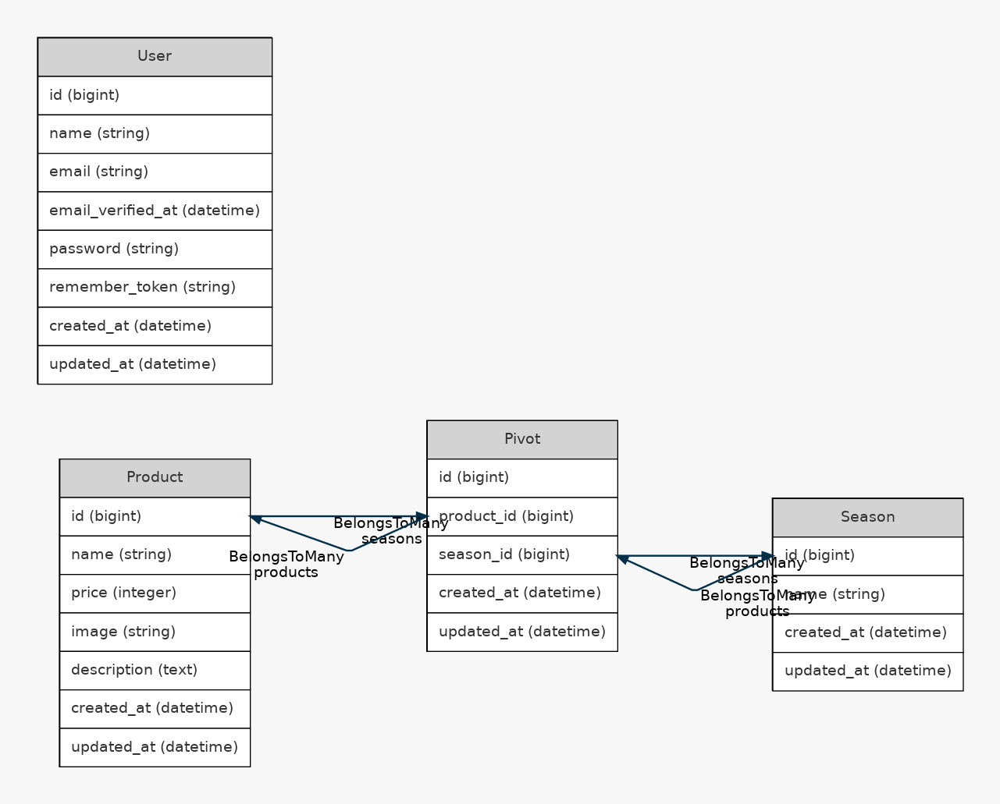

# Mogitate 商品管理システム
## 環境構築
#### Dockerビルド
1. ```php
    git clone git@github.com:ume32/mogitate.git
   ```
2.docker-compose up -d -build
#### ※ MySQLは、OSによって起動しない場合があるのでそれぞれのPCに合わせてdocker-compose.ymlファイルを編集してください。
#### Laravel環境構築
1.docker-compose exec php bash

2.composer install

3.env.exampleファイルから.envを作成し、環境変数を変更

4.php artisan key:generate

5.php artisan migrate

6.php artisan db:seed

## 使用技術

* PHP 8.0
* Laravel 10.0

##ER図


##URL
####開発環境：http://http://localhost/products
